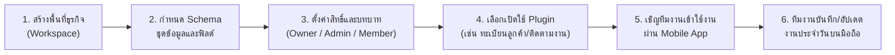

# Lattice

> **Build with blocks, not bloat.**  
> แพลตฟอร์มสร้างแอปสำหรับธุรกิจเล็ก โดยไม่ต้องเขียนโค้ดและไม่ต้องพัฒนา Backend เอง

---

## สารบัญ (Table of Contents)

- [1. ภาพรวมผลิตภัณฑ์ (Product Overview)](#1-ภาพรวมผลิตภัณฑ์-product-overview)
- [2. ปัญหาและคุณค่าหลัก (Problem & Value Proposition)](#2-ปัญหาและคุณค่าหลัก-problem--value-proposition)
- [3. เส้นทางใช้งานหลัก (Core User Journey)](#3-เส้นทางใช้งานหลัก-core-user-journey)
- [4. สถาปัตยกรรมระบบ (Architecture Principles)](#4-สถาปัตยกรรมระบบ-architecture-principles)
- [5. โครงสร้างโปรเจกต์ (Repository Structure)](#5-โครงสร้างโปรเจกต์-repository-structure)
- [6. การต่อยอดจาก PocketBase (PocketBase Integration Strategy)](#6-การต่อยอดจาก-pocketbase-pocketbase-integration-strategy)
- [7. ขอบเขต MVP และทิศทางในอนาคต (MVP Scope & Roadmap)](#7-ขอบเขต-mvp-และทิศทางในอนาคต-mvp-scope--roadmap)
- [8. แผนงานและ Milestone (Milestones)](#8-แผนงานและ-milestone-milestones)
- [9. ลิขสิทธิ์และการใช้งาน Third-Party (License & Compliance)](#9-ลิขสิทธิ์และการใช้งาน-third-party-license--compliance)

---

## 1. ภาพรวมผลิตภัณฑ์ (Product Overview)

**Lattice** เป็นแพลตฟอร์มสร้างแอปสำหรับธุรกิจขนาดย่อม (SMEs) ที่ต้องการจัดการข้อมูลธุรกิจและขั้นตอนการทำงาน (Workflow) ให้เป็นระบบ สมาชิกในทีมสามารถเข้าถึงและอัปเดตข้อมูลร่วมกันได้แบบ Real-time พร้อมระบบกำหนดสิทธิ์การเข้าถึงที่รัดกุม

* **Mobile App เป็นช่องทางหลักสำหรับการทำงานประจำวัน**: ทีมงานภาคสนามหรือพนักงานใช้ค้นหา เพิ่ม และแก้ไขข้อมูลผ่านสมาร์ตโฟนได้อย่างคล่องตัว
* **Web Admin สำหรับเจ้าของและผู้ดูแลระบบ**: ใช้สร้างพื้นที่ธุรกิจ (Workspace), กำหนด Schema ข้อมูล, จัดการบทบาทสมาชิก และเลือกเปิดใช้งานโมดูล (Plugin)
* **ไม่ต้องเขียนโค้ด (No-Code)**: ธุรกิจกำหนดเพียงว่าต้องการจัดเก็บข้อมูลอะไร ระบบจะแปลงเป็น Schema, หน้าจอ และ Backend API ให้อัตโนมัติ

---

## 2. ปัญหาและคุณค่าหลัก (Problem & Value Proposition)

| ปัญหาเดิมของธุรกิจ | สิ่งที่ Lattice มอบให้ |
| :--- | :--- |
| **ไฟล์กระจัดกระจายหลายชุด** (เช่น ใช้ Excel/LINE สับสนว่าไฟล์ไหนล่าสุด) | **Single Source of Truth**: ทุกคนในทีมทำงานบนฐานข้อมูลชุดเดียวกันแบบ Real-time |
| **แก้ไขข้อมูลบนมือถือได้ยาก** (ตารางสเปรดชีตแสดงผลไม่เหมาะกับหน้าจอมือถือ) | **Mobile-First UX**: แสดงผลเป็น Card, List และบันทึกผ่านฟอร์มที่ออกแบบมาสำหรับมือถือโดยเฉพาะ |
| **ควบคุมสิทธิ์ยาก** (ต้องแชร์ทั้งไฟล์ให้พนักงาน ทั้งที่มีข้อมูลบางส่วนที่เป็นความลับ) | **Role-Based Access Control (RBAC)**: กำหนดสิทธิ์การดู/แก้ไข/ลบ แยกตามบทบาทและระดับข้อมูล |
| **ต้นทุนพัฒนาซอฟต์แวร์สูง** (ต้องจ้างทีมพัฒนาเมื่อต้องการเพิ่ม Workflow ใหม่) | **Modular Plugins**: เลือกเปิดโมดูลที่พร้อมใช้งานและปรับแต่งให้เข้ากับโครงสร้างข้อมูลเดิม |

---

## 3. เส้นทางใช้งานหลัก (Core User Journey)



1. **Owner สร้างพื้นที่ธุรกิจ (Workspace)**: แบ่งแยกข้อมูลและบัญชีสมาชิกอย่างเป็นอิสระ (Multi-tenant)
2. **ออกแบบ Schema ข้อมูล**: กำหนดตารางข้อมูล ฟิลด์ ความสัมพันธ์ และประเภทข้อมูลที่ตรงกับงาน
3. **กำหนดสิทธิ์ทีมงาน**: จัดสรรบทบาท (Owner, Admin, Member) และสิทธิ์การเข้าถึงในแต่ละชุดข้อมูล
4. **เลือก Plugin ทางธุรกิจ**: เลือกโมดูลธุรกิจที่รองรับ Schema พร้อมตรวจสอบความเข้ากันได้
5. **เชิญสมาชิกเข้าสู่ Workspace**: ส่งคำเชิญและเข้าสู่ระบบผ่าน Mobile App
6. **ปฏิบัติงานประจำวัน**: สมาชิกค้นหา ดูรายการ บันทึก และอัปเดตสถานะงานผ่านแอปมือถือ

---

## 4. สถาปัตยกรรมระบบ (Architecture Principles)

Lattice ออกแบบภายใต้ 3 เสาหลักทางวิศวกรรม:

1. **ต่อยอดจาก PocketBase ในฐานะ Go Framework (`[KEEP]`)**:
   * นำ [PocketBase](https://pocketbase.io) มาใช้เป็น Go Library/Framework หลัก ห่อหุ้มด้วยโค้ดส่วนขยายของเรา ไม่แก้ไข Source Code ส่วน Core โดยตรง เพื่อให้สามารถอัปเกรดเวอร์ชันต้นน้ำได้อย่างราบรื่น
2. **ยึดสัญญา API เป็นศูนย์กลาง (Contract-First Design)**:
   * ทุก Schema และ Endpoint ใหม่ถูกกำหนดและระบุเวอร์ชันใน `contracts/` ตั้งแต่วันแรก เพื่อใช้ Code Generator สร้าง TypeScript Types, Client SDK และ Server Validator โดยอัตโนมัติ
3. **แกนประมวลผล UI รวมศูนย์ แยกเฉพาะชั้น Render (Shared UI Logic)**:
   * ทุกแพลตฟอร์ม (Web, Mobile, Desktop) แชร์ Contract, TypeScript SDK (`packages/sdk`) และ Business State Logic (`packages/ui-core`) ร่วมกัน และแยกเฉพาะส่วน UI Component ตามแพลตฟอร์ม

---

## 5. โครงสร้างโปรเจกต์ (Repository Structure)

โปรเจกต์จัดการในรูปแบบ Monorepo:

```
Lattice/
├── backend/            # Go module: เซิร์ฟเวอร์หลักที่ครอบบน PocketBase
│   ├── cmd/server/     # Entry point (pocketbase.New() + custom routes + plugins)
│   ├── internal/
│   │   ├── platform/   # plugin registry, outbox worker, features, tenant loader, secrets
│   │   ├── api/        # custom endpoints (/v1/*)
│   │   └── plugins/    # โมดูลธุรกิจในอนาคต (payments อยู่ใน M4)
│   └── migrations/     # migration เสริมต่อท้ายระบบ PocketBase
├── contracts/          # แหล่งความจริง (Single Source of Truth) ของ Schema & API
│   ├── openapi.yaml    # OpenAPI spec สำหรับ /v1/*
│   ├── schemas/        # JSON Schema (app-config, features, layout, plugin-manifest)
│   └── collections/    # นิยาม schema/collections เริ่มต้น
├── packages/           # TypeScript Packages ใช้ร่วมกันทุก Platform
│   ├── types/          # Types ที่ gen จาก contracts/
│   ├── sdk/            # SDK ครอบ PocketBase JS SDK + platform adapters
│   ├── ui-core/        # Headless logic, state, layout engine, hooks
│   └── ui-web/         # React UI components (Web + Desktop)
├── apps/               # ไคลเอนต์ปลายทาง
│   ├── client/         # Web Admin & Client SPA (Vite + React)
│   ├── mobile/         # Mobile App หลักสำหรับทีมงาน (Capacitor / React Native)
│   ├── desktop/        # Desktop App (Tauri v2 ห่อ apps/client)
│   └── site/           # เว็บไซต์ Landing / เอกสาร
├── tools/              # สคริปต์ Codegen, ตรวจสอบ License และ CI utilities
├── README.md           # เอกสารแนะนำภาพรวมและสถาปัตยกรรมของโครงการ
└── LICENSE.md          # รายละเอียดลิขสิทธิ์ซอฟต์แวร์และ Third-Party Notices
```

---

## 6. การต่อยอดจาก PocketBase (PocketBase Integration Strategy)

เราใช้ระบบสัญลักษณ์ในการจำแนกความรับผิดชอบของโค้ด:
* `[KEEP]` : ใช้ความสามารถเดิมของ PocketBase โดยตรง ไม่แก้ไข Source Code
* `[ADAPT]` : ใช้ความสามารถของ PocketBase แต่ปรับเปลี่ยนการตั้งค่าหรือการนำไปประยุกต์ใช้
* `[ADD]` : โค้ดและฟังก์ชันที่เราพัฒนาขึ้นใหม่ทั้งหมด

| ส่วนของระบบ | สถานะ | รายละเอียด |
| :--- | :---: | :--- |
| **Database & API Rules** | `[KEEP]` | Collections, Records CRUD, Rule engine ที่รันบน SQLite |
| **Authentication** | `[KEEP]` | Email/Password, OAuth2/OIDC, Multi-tenant tokens |
| **Realtime SSE** | `[KEEP]` | Server-Sent Events พร้อม Adapter เชื่อมต่อบน Mobile |
| **File Storage** | `[KEEP]` | จัดเก็บและให้บริการไฟล์แนบ/รูปภาพ |
| **Admin UI (PocketBase)**| `[ADAPT]` | สงวนไว้สำหรับ Superuser ภายในทีมเทคนิคเท่านั้น (ไม่เปิดให้ลูกค้า) |
| **Settings Provisioning** | `[ADAPT]` | ควบคุมการตั้งค่า (SMTP, S3, OAuth) ผ่านระบบ Control Plane |
| **Plugin Registry** | `[ADD]` | ระบบโหลด Manifest, ตรวจสอบ Dependency และเปิด/ปิดโมดูลตามสิทธิ์ |
| **Transactional Outbox** | `[ADD]` | เขียน Event ลง Outbox table ใน Transaction เดียวกับข้อมูล ป้องกัน Event สูญหาย |
| **Custom APIs (`/v1/*`)** | `[ADD]` | Endpoint สำหรับ Tenant Config, Feature Flags, และ Aggregation Data |
| **Cross-Platform Adapters** | `[ADD]` | ตัวกลางเชื่อมต่อ Keychain/SecureStore และ EventSource สำหรับ Mobile |

---

## 7. ลิขสิทธิ์และการใช้งาน Third-Party (License & Compliance)

Lattice ให้ความสำคัญอย่างยิ่งต่อความถูกต้องทางลิขสิทธิ์ซอฟต์แวร์และความโปร่งใสของ Open Source:

* **Lattice License**: โค้ดส่วนต่อขยายและแอปพลิเคชันของ Lattice เผยแพร่ภายใต้ **[MIT License](file:///C:/Users/A/Documents/GitHub/projects/Lattice/LICENSE.md)**
* **PocketBase Attribution**: โครงการนี้ใช้งานและต่อยอดจาก [PocketBase](https://github.com/pocketbase/pocketbase) (พัฒนาโดย *Gani Georgiev*) ภายใต้สัญญาอนุญาตแบบ **MIT License** โดยนำเข้าผ่าน Go module (`github.com/pocketbase/pocketbase`) สามารถตรวจสอบสัญญาอนุญาตต้นทางได้ที่ [PocketBase License on GitHub](https://github.com/pocketbase/pocketbase/blob/master/LICENSE.md)
* **License Compliance**: มีระบบตรวจสอบ License อัตโนมัติในกระบวนการ CI เพื่อควบคุม Dependency ให้เป็นไปตามมาตรฐานที่กำหนดและปฏิเสธ Dependency ที่ไม่เข้าข่าย Permissive License
* อ่านรายละเอียดและประกาศลิขสิทธิ์ฉบับสมบูรณ์ได้ที่ **[LICENSE.md](file:///C:/Users/A/Documents/GitHub/projects/Lattice/LICENSE.md)**
